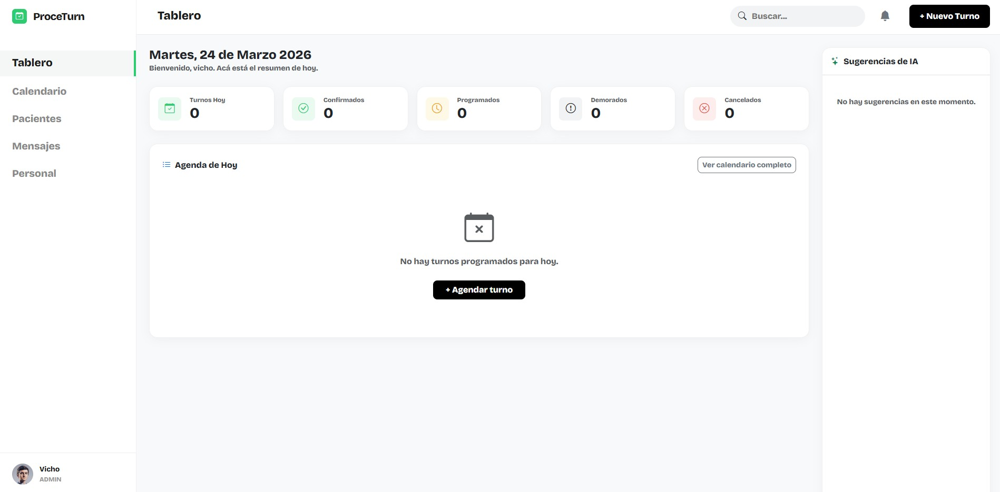
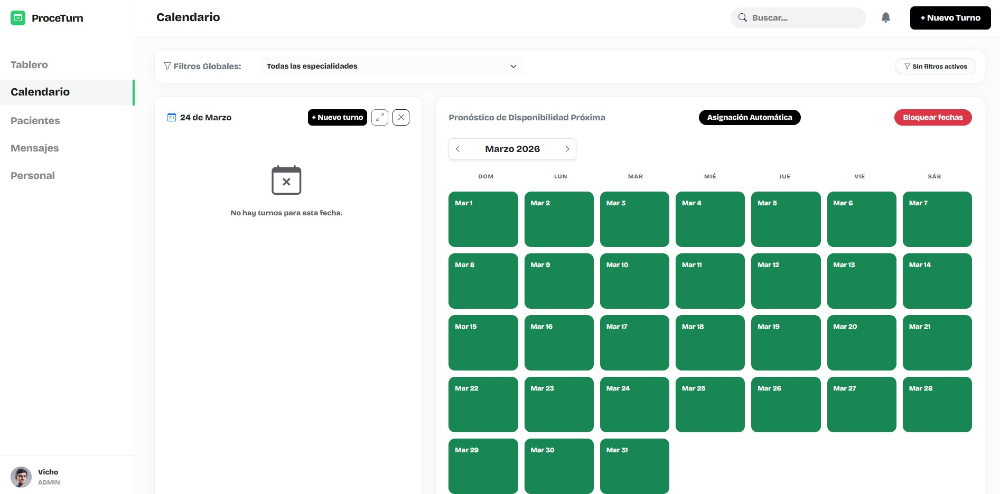
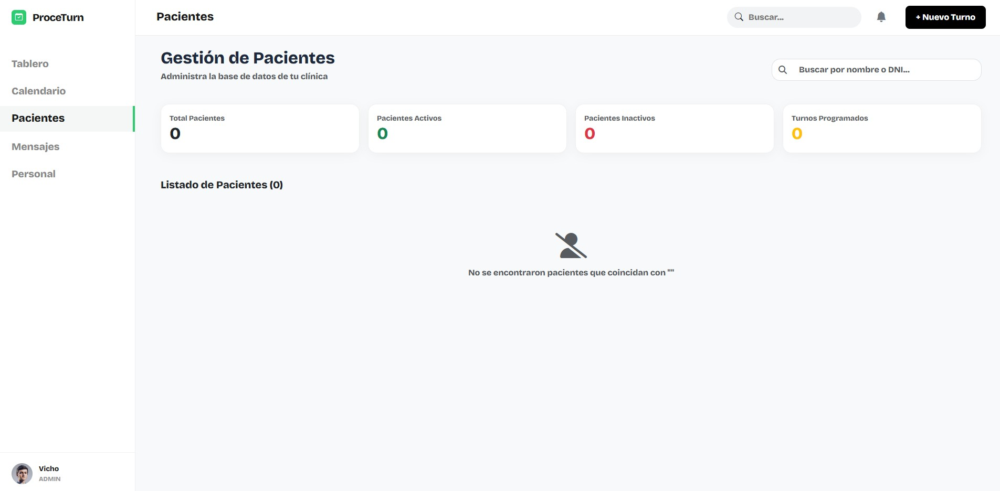
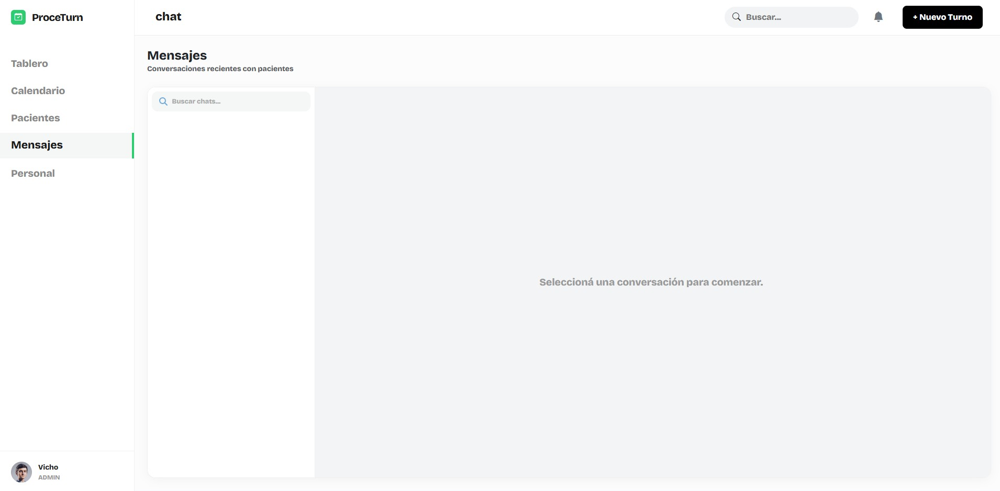
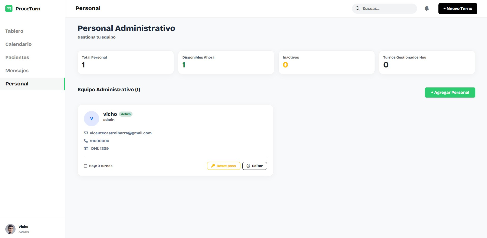
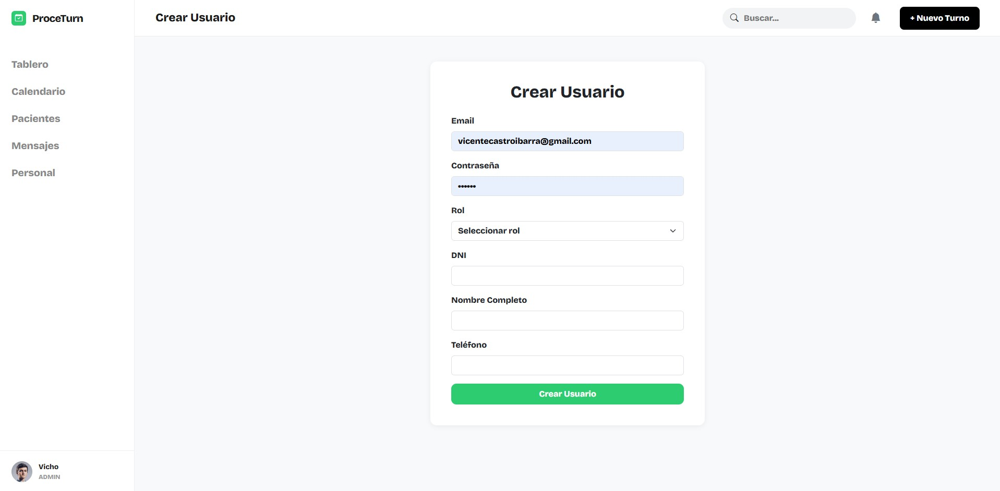
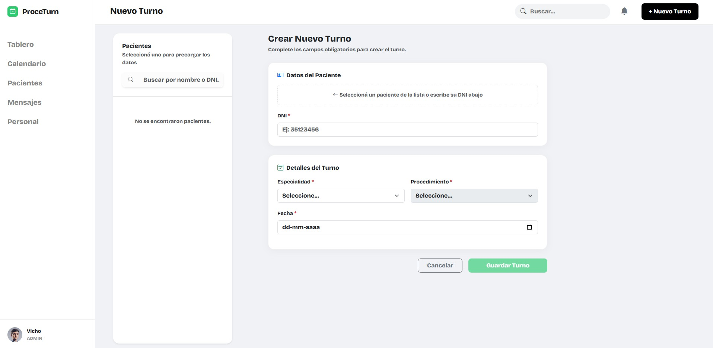
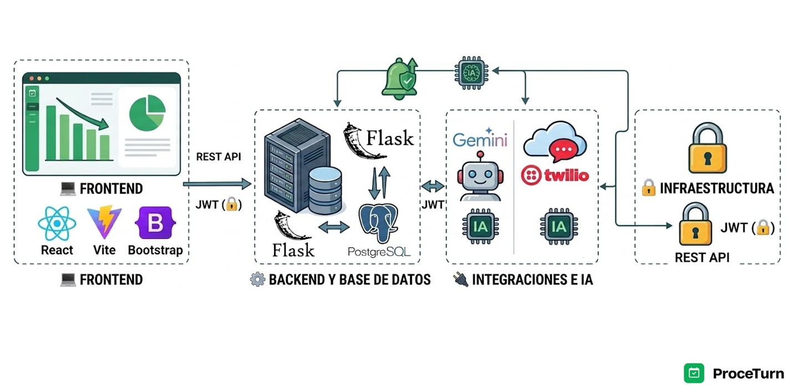

# 🏥 ProceTurn - Sistema Integral de Gestión de Turnos Clínicos

ProceTurn es una plataforma web B2B diseñada para modernizar y optimizar la asignación de turnos para procedimientos médicos en clínicas. Desarrollada para reemplazar la gestión manual e ineficiente, la aplicación centraliza agendas, historiales de pacientes, comunicación por chat (WhatsApp) y gestión del personal, apoyada por alertas y sugerencias automáticas e Inteligencia Artificial.

---

## 🚀 Mis Contribuciones (Vicente Castro)

Como desarrollador **Full Stack** en este proyecto colaborativo, participé activamente en todo el ciclo de vida del software (End-to-End). Mis responsabilidades y desarrollos principales incluyeron:

### Frontend (React + Vite + Bootstrap)

- **Diseño e implementación de UI/UX:** Construcción desde cero de las vistas principales de la aplicación asegurando un diseño limpio, moderno y responsivo.

- **Módulo "Tablero" (Dashboard):**
  - Creación del panel de control principal con métricas operativas del día actualizadas dinámicamente: turnos totales, turnos pendientes de asignación, turnos cancelados y mensajes sin leer.
  - Visualización compacta de cada turno mostrando nombre del paciente, horario, especialidad y profesional a cargo, con nombre redirigible al perfil del paciente.
  - Sistema de gestión de estado por turno mediante menú desplegable: confirmar llegada del paciente, marcar demora y cancelar turno con modal de confirmación y campo opcional para registro de motivo.
  - Detección automática de turnos no confirmados: si un turno llega a su hora programada sin confirmación, el sistema cambia su estado a "Sin confirmar" y lo mantiene tras 15 minutos de inactividad.
  - Notificaciones emergentes automáticas al detectar turnos no confirmados, mostrando nombre del paciente, hora del turno y estado actualizado (una sola notificación por turno).
  - Acceso rápido de contacto: al hacer clic en el correo o teléfono del paciente, se redirecciona a la plataforma correspondiente con los datos precargados para enviar el mensaje directamente.

- **Módulo "Calendario":**
  - Desarrollo de vista interactiva mensual que muestra todos los turnos del mes en todos sus estados.
  - Sistema visual de disponibilidad por colores con leyenda: disponible, parcialmente ocupado y completo, actualizado automáticamente ante creación o cancelación de turnos.
  - Lista lateral dinámica que se despliega al seleccionar un día, mostrando hora del turno, paciente, especialidad y estado. Se actualiza automáticamente al cambiar de día y respeta los filtros activos. Incluye mensaje informativo si no hay turnos para la fecha seleccionada.
  - Vista expandible: botón para ampliar la lista de turnos ocultando el calendario, con opción de restaurar la vista original.
  - Filtros globales por especialidad/procedimiento que persisten al cambiar de día o mes, con indicador visual del filtro activo y opción para limpiar filtros y volver a la vista general.
  - Actualización correcta de disponibilidad al cambiar de mes.

- **Módulo "Personal" (Panel de Administración):**
  - Creación de nuevos usuarios con registro de email, contraseña, DNI y número de teléfono, con validaciones que impiden duplicados de email y DNI, y advertencias en caso de campos vacíos.
  - Asignación obligatoria de rol al crear usuario, con modal de confirmación de seguridad al asignar rol de administrador ("Se le va a asignar a X usuario el rol de administrador, ¿está seguro de proceder?").
  - Edición de usuarios existentes con modificación de email, teléfono y DNI, validando unicidad de datos. Registro de auditoría que guarda quién realizó el cambio, qué campos fueron modificados, y fecha y hora de la modificación. Mensaje de confirmación al guardar cambios.
  - Modificación de roles de usuarios existentes con actualización inmediata de permisos y confirmación de seguridad al asignar rol de administrador.
  - Deshabilitación de cuentas sin eliminación, accesible desde el perfil del usuario con modal de confirmación y aviso de sesión deshabilitada al usuario afectado.

### Backend & Base de Datos (Python + Flask + PostgreSQL)

- **Modelado de Datos:** Diseño y construcción de modelos relacionales clave utilizando **SQLAlchemy**.
- **Desarrollo de API REST:** Creación de múltiples endpoints en **Flask** para conectar el cliente (React) con la base de datos de manera eficiente, incluyendo endpoints para gestión de turnos (creación, confirmación, cancelación con liberación de horario), gestión de usuarios (CRUD completo con validaciones) y filtrado dinámico de datos.
- **Seguridad y Autenticación:** Implementación de flujos de seguridad utilizando tokens **JWT** para proteger rutas privadas y gestionar sesiones de administradores.

---

## 🛠️ Stack Tecnológico y Arquitectura

El sistema está construido sobre una arquitectura moderna y escalable, integrando servicios externos para potenciar sus funcionalidades.

**Frontend:**
    

**Backend & DB:**
   

**Integraciones:**
 

---

## 📌 Funcionalidades Destacadas

- 📊 **Dashboard de Control:** Monitoreo en tiempo real de la capacidad clínica diaria con métricas dinámicas (turnos totales, pendientes, cancelados, mensajes sin leer). Incluye sistema de notificaciones automáticas para turnos no confirmados y acceso rápido de contacto al paciente con redirección a WhatsApp o email con datos precargados.

- 📅 **Gestión Avanzada de Agendas:** Calendario interactivo mensual con sistema visual de disponibilidad por colores, filtros globales por especialidad, lista lateral dinámica de turnos por día con vista expandible, y gestión completa de estados (confirmar, demorar, cancelar) con registro de motivos y liberación automática de horarios.

- 👥 **Base de Pacientes:** Registro completo e historial médico/turnos para toma de decisiones informadas (ej. ratio de cancelaciones).

- 💬 **Comunicación Omnicanal (Twilio):** Vista de chat integrada directamente en la aplicación para interactuar con los pacientes vía WhatsApp.

- 🤖 **Asistencia con IA (Gemini):** Sugerencias inteligentes integradas en el flujo de trabajo.

- 🔐 **Gestión de Accesos:** Panel de administración con CRUD completo de usuarios, asignación y modificación de roles con confirmaciones de seguridad, deshabilitación de cuentas sin eliminación, validaciones de unicidad de datos, y registro de auditoría que rastrea quién modificó qué, cuándo y qué campos fueron alterados.

---

## 🤝 Equipo de Desarrollo

Este proyecto fue desarrollado bajo metodologías ágiles simulando un entorno de trabajo real, junto a mis compañeros:

- **Jaime Vega** - _Full Stack Developer_ - [GitHub](https://github.com/Drokko-Dev)
- **Francisco M. Gómez** - _Full Stack Developer_ - [GitHub](https://github.com/Fragoz22)
- **Laureano González** - _Full Stack Developer_ - [GitHub](https://github.com/laureanogonzalez02)
- **Vicente Castro Ibarra** - _Full Stack Developer_ - [GitHub](https://github.com/VicenteCastroIb)
